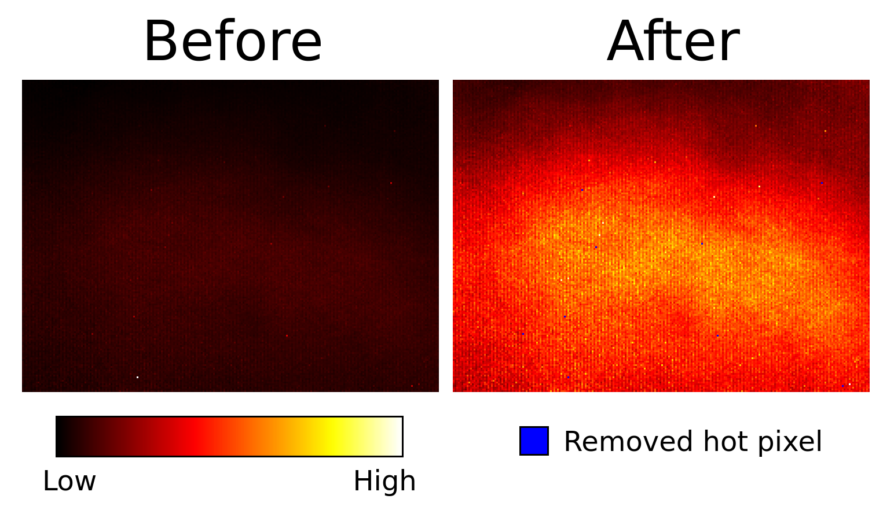

# DVS Hot Pixel Filter

Sometimes, you have a rosbag that contains hot pixels that fire many noise events.
This package automatically detects hot pixels and creates a new rosbag without hot pixel events.
It counts all events in the rosbag, then removes pixels based on either:

  * Top N pixels that receive most events, where N can be set using optional command-line flag --n_hot_pix,
  
    **or**, if --n_hot_pix is not set (or = -1),
  * Pixels that receive more than n_std*&sigma; (standard deviations) events (default n_std = 5).

Usage:

        rosrun dvs_hot_pixel_filter hot_pixel_filter path_to_input.bag
        
Additional (optional) command-line flags include:
  * --n_hot_pix=<number_of_hot_pixels>
  * --n_std=<number_of_standard_deviations> (default n_std = 5)
  * --no_stats (do not save stats on disk)

A new rosbag will be written, name ```input.bag.filtered```. It is an exact copy of the original bag, except hot pixel events have been removed.

## Installation

Assumes you have already set up your workspace (see [here](https://github.com/cedric-scheerlinck/dvs_image_reconstruction) for more details).

Clone this repository into your catkin workspace:

    cd ~/catkin_ws/src/
    git clone https://github.com/cedric-scheerlinck/dvs_hot_pixel_filter.git

Clone dependencies:

    vcs-import < dvs_hot_pixel_filter/dependencies.yaml

Build

    catkin build dvs_hot_pixel_filter
    source ~/catkin_ws/devel/setup.bash 
    
## Statistics

Saves output statistics to ```./stats/<bag_name>/```.


### Hot Pixels List

```hot_pixels.txt``` contains a list of hot pixel coordinates with format: ```x, y```.

### Event Count Histogram

The package will output histograms before and after the hot pixels have been removed.



